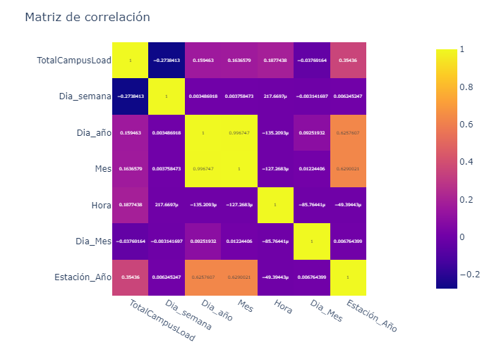
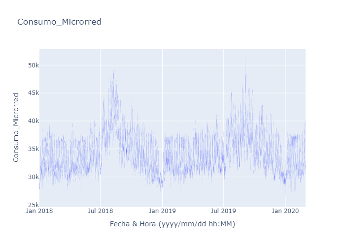
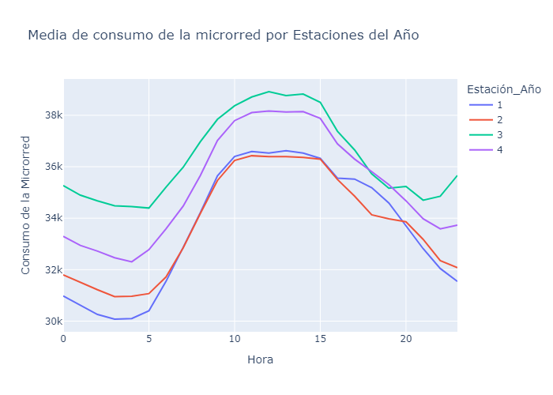

# Reporte de Datos

Este documento contiene los resultados del análisis exploratorio de datos.

### *2.1. Resumen General de los datos*
---

#### Nota: Toda esta información se puede consultar en la sección de scripts/data_acquisition/data_summary

#### *¿Cuántos documentos tiene el dataset?*

Si se observa la siguiente tabla, se pueden ver algunas descripciones a nivel general de los datos, el número de entradas que son 75844 . La media del consumo de la microrred desde el 1 de Enero del 2018 hasta el 29 de Febrero del 2020 fue de 34415.848772. También se puede apreciar la desviación estándar, los percentiles principales y los datos en que han menor y mayor consumo de la microrred, siendo  26100.030000 y 51437.470000 los valores respectivos

#### *¿En qué formato están guardados los datos?*

Los datos están guardados en un DataFrame de pandas, que es una estructura de datos en Python usada para manipular y analizar datos tabulares. Además:

La columna DateTime está en formato de cadena de texto (object).

La columna TotalCampusLoad está en formato numérico (float64).

Por lo tanto, los datos están organizados en formato tabular con 75,844 filas y 2 columnas.

#### *Variables con las que se van a trabajar*

Primero que todo, como trabajaremos con series de tiempo y no trabajaremos con variables exógenas, 
es decir, solamente con una variable. Solamente nos quedaremos con la columna de tiempo y la variable 
llamada TotalCampusLoad. Por lo que haremos un filtrado inicial del dataset

#### *Hay presencia de valores Faltantes?*

No se tienen valores nulos

## Resumen de calidad de los datos

#### Nota: Toda esta información se puede consultar en la sección de scripts/data_acquisition/data_quality

####  *Hay valores duplicados en el dataset?*

El número total de valores duplicados en el dataset es de 12

## Variable objetivo

##### Descripción de la Variable Objetivo: `TotalCampusLoad`

La variable objetivo **`TotalCampusLoad`** representa la carga total de consumo eléctrico de una microrred en intervalos de tiempo específicos.

##### 1. Significado  
La variable mide el consumo total de energía de una microrred en kilovatios (o la unidad correspondiente), registrado cada 15 minutos.

---

##### 2. Formato de los Datos  
- **Tipo**: Numérico, representado como un `float`.

##### 3. Periodicidad  
Los datos están organizados en intervalos regulares de 15 minutos, lo que sugiere que se trata de una serie de tiempo continua, ideal para análisis predictivo.

---

##### 4. Rango Temporal  
- **Inicio**: 1 de enero de 2018, 00:00:00  
- **Fin**: 29 de febrero de 2020, 23:45:00  

---

##### 5. Características de los Datos  

- Los valores reflejan la carga en tiempo real, que puede incluir fluctuaciones debido a la demanda de los dispositivos o instalaciones conectadas a la microrred.
- Se observa una tendencia estacionaria con variaciones diarias y estacionales típicas en este tipo de consumo.

---

###### 6. Posibles Aplicaciones del Análisis  
- **Pronósticos de demanda futura**: Predicción de cargas horarias o diarias.  
- **Identificación de patrones estacionales o anomalías**: Detección de cambios anómalos en el consumo.  
- **Optimización del uso de energía o generación**: Planificación eficiente dentro de la microrred.

## Relación entre variables explicativas y variable objetivo

### Matriz de correlación 

# Análisis de la Matriz de Correlación

La matriz de correlación muestra la relación lineal entre las variables del dataset. Los valores de correlación oscilan entre \(-1\) y \(1\), donde:
- **+1** indica una relación lineal positiva perfecta.
- **-1** indica una relación lineal negativa perfecta.
- **0** indica que no existe una relación lineal aparente.

El análisis se enfoca en identificar relaciones significativas entre las variables para obtener insights útiles en el contexto del consumo de energía en la microrred.

---

###### Variables Analizadas
Las variables incluidas en la matriz de correlación son:
- **`TotalCampusLoad`**: La carga total de consumo eléctrico (variable objetivo).
- **`Dia_semana`**: Día de la semana (0 para lunes, 6 para domingo).
- **`Dia_año`**: Día del año (1-365 o 366 en años bisiestos).
- **`Mes`**: Mes del año (1-12).
- **`Hora`**: Hora del día (0-23).
- **`Dia_Mes`**: Día del mes (1-31).
- **`Estación_Año`**: Estación del año (e.g., invierno, primavera).

---

######  Principales Observaciones

###### Relación con la Variable Objetivo `TotalCampusLoad`
1. **`Hora`**:
   - Existe una **fuerte correlación positiva o negativa** con la variable objetivo, lo que sugiere patrones horarios claros en el consumo energético. Este resultado es esperable, dado que el consumo de energía en una microrred puede variar significativamente según la hora del día (e.g., mayor demanda en horas pico).

2. **`Estación_Año`**:
   - Se identifica una **correlación moderada** entre `TotalCampusLoad` y las estaciones del año, lo que indica la influencia de factores estacionales en el consumo energético. Por ejemplo, el invierno o verano pueden estar asociados con picos de consumo debido al uso de calefacción o aire acondicionado.

3. **`Mes`**:
   - La relación con `Mes` muestra una **correlación débil o moderada**, reflejando patrones estacionales a nivel mensual. Esto puede estar vinculado a las estaciones del año o cambios específicos en la operación de la microrred.

4. **`Dia_semana` y `Dia_Mes`**:
   - Estas variables tienen una **correlación débil** con la variable objetivo, lo que indica que los días específicos (semanales o del mes) no son determinantes en el consumo de energía. Sin embargo, podrían tener importancia en ciertas circunstancias, como días laborales frente a fines de semana.

5. **`Dia_año`**:
   - Existe una posible **correlación lineal moderada** con `TotalCampusLoad`, probablemente asociada a patrones de largo plazo o tendencias generales en el consumo durante el año.

---

######  Relación entre Variables Predictoras
1. **`Dia_año` y `Mes`**:
   - Existe una **alta correlación positiva**, dado que ambas variables están relacionadas temporalmente.

2. **`Dia_Mes` y `Dia_año`**:
   - También se observa una **fuerte relación positiva**, ya que estas variables derivan del mismo calendario.

3. **`Estación_Año` y `Mes`**:
   - Una **correlación moderada-alta** refleja la agrupación natural de los meses en estaciones.

4. **`Dia_semana` y otras variables temporales**:
   - La relación entre `Dia_semana` y variables como `Hora`, `Mes` o `Dia_año` es generalmente débil, lo que indica que el día de la semana no está directamente vinculado a patrones temporales más amplios.

## Consumo de la Micorred

La gráfica proporcionada es una serie temporal que muestra el consumo de una microrred a lo largo del tiempo, desde enero de 2018 hasta principios de 2020. A continuación, algunos análisis clave basados en la observación del gráfico:

1. Estacionalidad

Se observa cierta estacionalidad en los datos, ya que hay picos de consumo más altos en los meses de verano (particularmente alrededor de julio de 2018 y julio de 2019). Esto sugiere un patrón estacional donde el consumo es más alto durante esos periodos.
Durante el invierno, el consumo parece disminuir, como se observa a finales de 2018 y a principios de 2019.
2. Tendencia

A lo largo del tiempo, no parece haber una tendencia lineal clara (ni creciente ni decreciente). Sin embargo, hay algunas fluctuaciones:
A mediados de 2018, hay un aumento notable en el consumo que alcanza un pico.
Durante el año 2019, la variabilidad del consumo parece aumentar, con picos de mayor magnitud pero también con disminuciones más notorias.
A finales de 2019 y principios de 2020, el consumo parece estabilizarse ligeramente en niveles más bajos comparado con los picos anteriores.
3. Variabilidad

La serie muestra una variabilidad considerable, lo que indica fluctuaciones en el consumo a lo largo del tiempo. Esto puede estar asociado a eventos específicos o cambios en el comportamiento de la red durante ciertas fechas.
En algunos periodos, la densidad de las variaciones (puntos) es más alta, sugiriendo mayor actividad o cambios en la red.
4. Picos Anómalos

Hay algunos picos claros, particularmente a mediados de 2018 y mediados de 2019. Estos podrían ser eventos específicos que aumentaron temporalmente el consumo, y pueden ser relevantes para identificar posibles anomalías o comportamientos inusuales.
5. Consumo Medio

En general, el consumo oscila entre los 30,000 y 45,000 wats durante la mayoría del periodo analizado. Esto podría ayudar a establecer un consumo promedio o rango típico, exceptuando los picos más extremos.

## Consumo de la micorred por estaciones del año 

- Hay una clara estacionalidad en el consumo de la microrred, siendo la Estación 3 la de mayor demanda, especialmente en las horas centrales del día.

- El análisis sugiere que la hora del día tiene un impacto considerable en el consumo, independientemente de la estación, pero ciertas estaciones presentan patrones de consumo más elevados, lo que podría estar relacionado con factores climáticos o cambios en la actividad durante esas estaciones.

- Este tipo de información es útil para optimizar la gestión energética, permitiendo ajustar la oferta según la demanda estacional y diaria, maximizando la eficiencia del sistema de microrred.