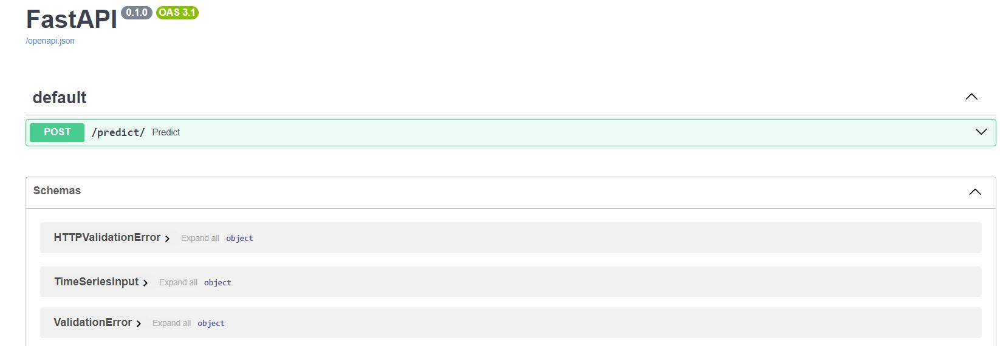

# Despliegue de modelos

Este documento proporciona una guía estructurada para el despliegue de un modelo de predicción de demanda energética basado en series de tiempo. El modelo, denominado time_series_model.h5, ha sido entrenado utilizando TensorFlow y Keras y está diseñado para hacer predicciones precisas basadas en datos históricos. A continuación, se detallan los aspectos clave relacionados con su despliegue:

El código del despliegue se encuentra en : **scripts-Deployment-main.py**

El modelo utilizado se encuentra en :
**scripts-training-time_series_models.h5** 

## Infraestructura

- **Nombre del modelo:** time_series_models.h5
- **Plataforma de despliegue:** Render
- **Requisitos técnicos:** : 
        Versión de Python: 3.10.11

        Dependencias:

        - pandas==2.2.3

        - tabulate==0.9.0

        - plotly

        - kaleido

        - fastapi

        - uvicorn

        - tensorflow

        - scikit-learn

- **Requisitos de seguridad:** : No hay 

- **Diagrama de arquitectura:** 

## Código de despliegue

- **Archivo principal:** El código desl despliegue se encuentra en : 
**scripts-Deployment-main.py**

- **Rutas de acceso a los archivos:** El modelo utilizado se encuentra en :  **scripts-training-time_series_models.h5** 

- **Variables de entorno:** : No es necesario variables de entorno

## Documentación del despliegue

- **Instrucciones de instalación:** 

**Guía de Despliegue del Modelo `time_series_models.h5` con FastAPI en Render**

Esta guía detalla cómo desplegar un modelo de series de tiempo usando **FastAPI** en la plataforma **Render**. El modelo se encuentra en la carpeta `scripts-training` con el nombre `time_series_models.h5`.

**Preparar el proyecto**

Los scripts del proyecto se encuentran en la carpeta Deployment y el archivo principal tiene el nombre main.py, este se encargará de ejecutar los otos archivos y es el que cuenta con el código de FastApi y que a su vez contiene el modelo que se encarga de hacer las predicciones. 

**Preparar todo desde la página de render**

Render funciona integrando tus repositorios de Github para que haya un 
CI/CD con tus repos , se debe configurar el comando para ejecutar el archivo principal. 

En este caso es algo como esto: 

**uvicorn main:app --host 0.0.0.0 --port $PORT**

Este comando lo que hace básicamente es poder ejecutar el archivo principal creado en fastApi

Cuando se guarden los cambios en render se iniciará el despliegue. Un vídeo útil para este proceso es el siguiente:

[Guía de despliegue en render](https://www.youtube.com/watch?v=RKtl_L4ASQ4&t=188s)

## **Instrucciones de uso:** 

Para utlizar el modelo desplegado en la web accedemoss a este link : 

Nota: Tener en cuenta que como estamos utilizando la versión gratuita de render y si el link no se ha usado en 15 minutos , Render "apagará" el endpoint por así decirlo, por lo que si es la primera vez que se carga el link en mucho tiempo , debemos esperar aproximadamente dos minutos a que el link cargue. 

[Link del modelo desplegado en fastApi](https://deploy-final-project-time-series.onrender.com/docs)

Luego de que el link está activo veremos una pantalla como la siguiente: 

damos click en la flecha hacia abajo al lado de /predict/ y a continuación daremos click en Try it out. 

Ahora lo que tenemos que hacer es meter algunos datos y el modelo se encargará de hacer la predicción de los posibles datos futuros en base a los datos que ingresemos. 

A continuación en esta misma carpeta se adjunta un archivo txt llamado **datos_ejemplo.txt** con datos de prueba para ingresar como body. Por favor, ingresar al archivo y  copiar y pegar (ctrl + E) la información , la ingresamos abajo en donde dice request body

Finalmente se le da en execute y tendremos nuestra predicción. 

Muchas gracias por leer esta guía

## **Instrucciones de mantenimiento:** 

El mantenimiento de un modelo de series de tiempo implica asegurarse de que la API funcione correctamente, el modelo esté actualizado con datos recientes, y el flujo de CI/CD sea robusto para manejar actualizaciones sin interrupciones.:

- **Versionamiento del Modelo:** Se puede Utilizar un sistema de versionamiento (por ejemplo, v1, v2) en la API para manejar actualizaciones sin afectar a los clientes existentes.

- **Gestión de Entornos:** Asegurarse de tener entornos separados para desarrollo, pruebas, y producción. Se pueden usar herramientas como Docker y Kubernetes para garantizar consistencia entre entornos.

- **Configuración de CI/CD:** Se pueden Utilizar herramientas como GitHub Actions, GitLab CI, o Jenkins para implementar pipelines automatizados.
